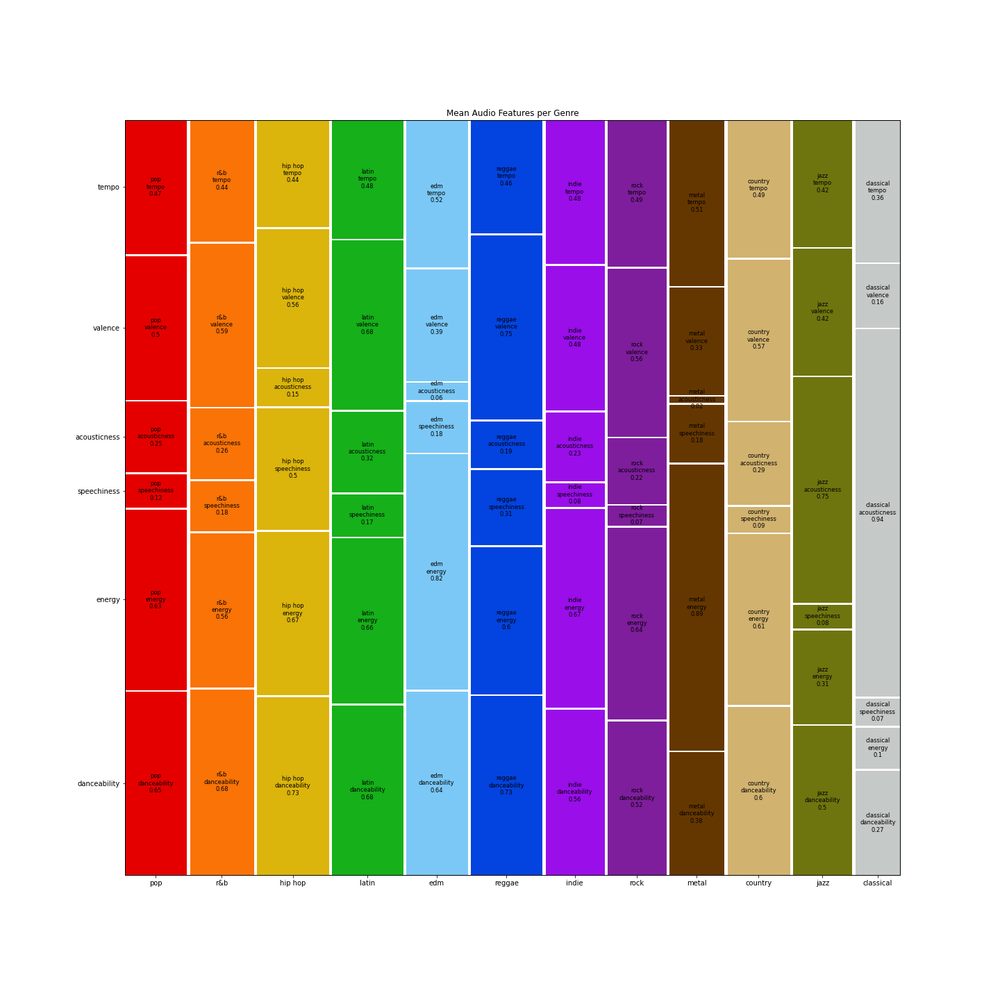

# Music-Genre-Classification

This project aims to train various classification models on the audio features of songs to predict which of the twelve major genres they belong to. An accurate model of the evolving landscape of music over time would provide actionable information about how to cluster artists, segment fanbases, and most importantly, serve as a tool for recommender systems by identifying bodies of similar music users’ preferred songs or artists. Recommender Systems are tasked at recommending items to users that maximize their utility, or in other words, songs that have a high probability of satisfaction. However, user-item utility is almost always unknown and must be inferred, especially in the context of discovery where the goal is to present novel items to the user. Consequently, an item’s utility for a user is usually estimated from past samples of correct utility data. This information can be acquired explicitly, such as in the form of a rating, or implicitly, by monitoring users’ behavior. Since explicit ratings are often not available, especially in the context of music, being able to identify similar content to what the user already prefers helps generate a pool of possible recommendations that an algorithm can choose between based on expected utility. 

## 1. Data Collection

The models learn to predict a song’s genre given its audio features, as well as other track-wise information, which were all collected from Spotify’s publicly available API database. Below are good examples of songs for their genres. It is clear that the audio features represent each differently.

**Danceability:** How suitable a track is for dancing
**Energy:** A perceptual measure of intensity and activity
**Loudness:** The overall loudness of a track in decibels (dB)
**Speechiness:** Represents the presence of spoken words in a track
**Acousticness:** Confidence measure as to whether a song is acoustic
**Instrumentalness:** Confidence measure as to whether a song contains no lyrics
**Valence:** Represents the musical positiveness conveyed by a track
**Tempo:** The overall estimated tempo of a track in beats per minute (BPM)
**Release Date:** The date that the song was released
**Duration:** The duration of the track (ms)

Since Spotify doesn't store genre information, I turned to The [Sounds of Spotify](https://open.spotify.com/user/thesoundsofspotify), an independent music genre project that utilized unsupervised learning techniques to identify new and unique genres of music (more of which can be read about [here](https://artists.spotify.com/blog/how-spotify-discovers-the-genres-of-tomorrow)), to generate the dataset of songs and their genre labels that were used to train various predictive models. 

## 2. Exploratory Data Analysis

Between any of the above features, energy and loudness exhibit the strongest relationship, with a correlation of 0.82. It makes intuitive sense that subjectively more energetic songs would tend to be louder on average. 

Another moderate correlation exists between danceability and valence, with a correlation of 0.58. Although their relationship expresses far more variability than that of as that of energy and loudness, there is clearly a positive association between a song's suitability for dancing and its overall positivity.

In exploring and comparing the differences in the distributions of the audio features of songs from each genre, it became apparent that each major genre, as described by the data, is unique in their own ways, and the combinations of their subjective features are mostly different from one another. The average audio feature representations for each genre are displayed in the mosaic plot below:

Pop songs are characterized as moderately danceable and energetic on average:

R&B songs are also moderately danceable and energetic on average:

Hip Hop songs are characterized as highly danceable, energetic, and most importantly, very speechy on average:

Latin songs are not only characterized as highly danceable, energetic, but they are also very positive on average comparatively to most other genres:

EDM songs are very energetic on average:

Reggae songs have the highest valence on average:

Indie songs are generally very energetic and their average featural representation resembles those of the Pop, Rock, and Country genres:

Rock and Country songs are moderately danceable, energetic, and valent on average. Their main difference is that country music is slightly more acoustic and faster paced on average. Both of their average featural representation resembles those of both the Pop and Indie genres:

Metal songs are the most energetic on average comparatively to other genres and are not acoustic whatsoever:

Jazz songs are very acoustic on average, and typically, they're not energetic:

Classical songs are, in fact, the most acoustic and the least energetic of all genres on average:

Lastly, both Jazz and Classical songs tend to be quite longer than the other major genres.
To determine whether the audio feature representations of each genre are significantly different from one another, firstly, a series of independent t-tests were conducted on each pair of audio features between the two genres. Then, a logistic regression was conducted using the audio features of the genres as the independent variables and the genres themselves as the dependent variables. For each pair of similar genres (Rock vs Country, Rock vs Metal, Hip Hop vs R&B, Pop vs Rock, Pop vs Latin, Pop vs Indie, and Pop vs Country), all of the t-tests were highly significant (p < 0.01) and the Logistic Regressions all had generally high accuracies (above 65%).

## 3. Modeling

To predict the genre of new songs, I sought to train various classification models on the audio features of the songs from each genre and compare their performance on unseen data. The Decision Tree Classifier was 66% percent accurate on average. The genres that the model learned best were Classical, Jazz, and Metal, whereas Pop was the most difficult genre to classify. Although the proceeding ensemble methods will surely outperform this model, it serves as a base to compare the improvement of more complex models. 

The Random Forest Classifier, with 498 estimators, as suggested by a randomized search of hyperparameters with cross validation, performed far better, averaging 75% accuracy. This model still picked up Classical, Jazz, and Metal the best, but its performance on the remaining genres significantly improved across the board, as well, shown in the confusion matrix below.

On the other hand, the Gradient Boosting Classifier, with 455 estimators, a 0.1 learning rate, and a maximum tree depth of 4, as suggested by a randomized search of hyperparameters with cross validation, was only 74% accurate on average. 

Lastly, the Extreme Gradient Boosting (XGB) Classifier, with 401 estimators, a 0.25 lambda rate, a 0.1 gamma rate, a 0.1 learning rate, and a maximum tree depth of 7, as suggested by a randomized search of hyperparameters with cross validation, was 75% accurate on average, and was the best performer comparatively to the other models.

## 4. Conclusion

