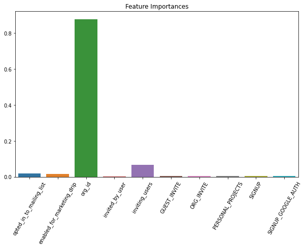

# Relax-Inc-Challenge

Using two datasets containing information about 12,000 users of a product over the span of two years and their usage of that product during that time, this project aims to identify which factors predict future user adoption. An "adopted user" is defined as a user who has logged into the product on three separate days in at least one seven-day period.

A Random Forest model was trained on the information of 12,000 users who have signed up to use the product in a two year span to predict whether or not users have adopted the product. As seen below, the model's feature importances suggest that the organization that the user belongs to is the most significant factor in predicting adoption. Further experimentation would need to be conducted to determine whether users' affiliation with organizations actually causes adoption of the product.

